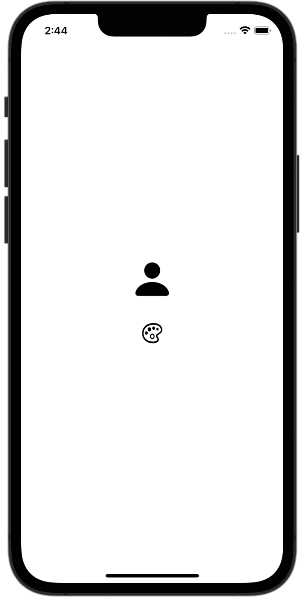
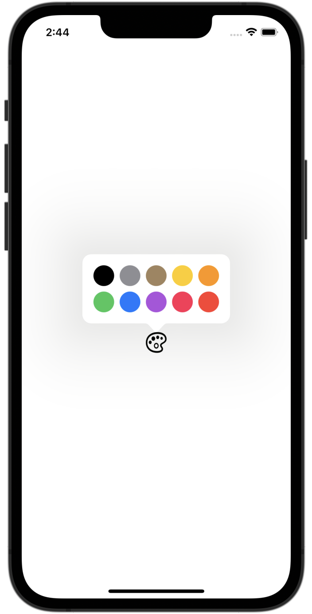
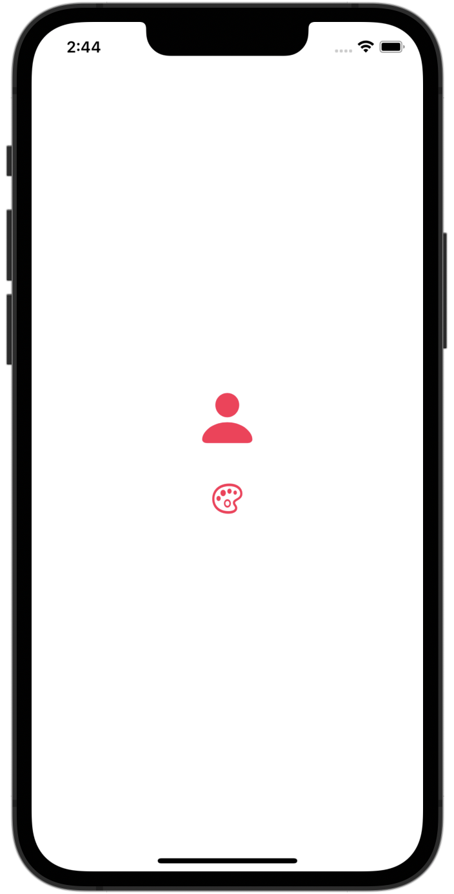

# ColorPicker Button

`ColorPickerButton` is a button implemented in SwiftUI that displays a color list in a popover.

<div style="display: flex; justify-content: space-around;">
    
    
    
</div>

## 対応バージョン

- iOS 17.0+
- macOS 14.0+

## Features

- Sets the color list and displays a color picker in a popover.

## Installation

To install `ColorPickerButton` using Swift Package Manager, add the following to your `Package.swift` file:

```swift
dependencies: [
    .package(url: "https://github.com/sakes9/ColorPickerButton.git", from: "{{ version }}")
]
```

Then, add `ColorPickerButton` as a dependency to your target:

```swift
.target(
    name: "YourTargetName",
    dependencies: ["ColorPickerButton"]
)
```

## Usage

Here's a basic example of how to use `ColorPickerButton` in your SwiftUI view:

```swift
import ColorPickerButton
import SwiftUI

struct ContentView: View {
    let colors: [ColorPickerButton.Color] = [
        .init(id: 1, color: .black),
        .init(id: 2, color: .gray),
        .init(id: 3, color: .brown),
        .init(id: 4, color: .yellow),
        .init(id: 5, color: .orange),
        .init(id: 6, color: .green),
        .init(id: 7, color: .blue),
        .init(id: 8, color: .purple),
        .init(id: 9, color: .pink),
        .init(id: 10, color: .red)
    ]

    @State private var selectedColor: Color = .black

    var body: some View {
        VStack(spacing: 40) {
            Image(systemName: "person.fill")
                .resizable()
                .frame(width: 50, height: 50)
                .foregroundColor(selectedColor)

            ColorPickerButton(colors: colors, onSelected: { selectedColorId in
                print("Selected color ID: \(String(describing: selectedColorId))")
                selectedColor = colors.first(where: { $0.id == selectedColorId })?.color ?? .black
            })
            .frame(width: 30, height: 30)
        }
        .padding()
    }
}
```

### Parameters

- `colors`: An array of `ColorPickerButton.Color` instances that contain the colors to display in the popover.
- `onSelected`: A callback that is called when a color is selected. It takes the selected color ID as an argument.
